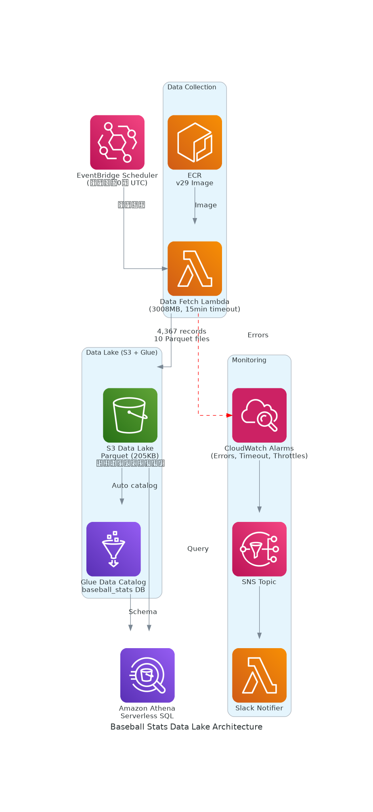

# Baseball CDK Project - Data Lake Edition

## プロジェクト概要

このプロジェクトは、AWS CDKを使用して構築された野球データ収集・保存システムです。`pybaseball`ライブラリを使用してMLBの打撃統計データを取得し、**S3 Data LakeにParquet形式で保存**します。毎週日曜0時（UTC）にEventBridgeスケジューラーにより自動実行され、AthenaとMetabaseでSQLクエリ可能です。

### データレイク回帰アプローチ

このシステムは「データレイク回帰」の思想に基づいています：
- まずS3にParquet形式でデータを蓄積（スキーマ変更に柔軟）
- 3〜5年後に確立されたベストプラクティスに合わせて移行可能
- Athena, Snowflake, BigQuery, Databricks等、どの分析ツールにも対応可能

## アーキテクチャ



**アーキテクチャフロー:**
```
EventBridge (週次スケジュール)
    ↓
Lambda (ECRコンテナ, VPC外)
    ↓
S3 Data Lake (Parquet, パーティション分割)
    ↓
AWS Glue Data Catalog
    ↓
Amazon Athena (SQLクエリ)
    ↓
Metabase / その他BIツール

CloudWatch Alarms
    ↓
SNS Topic
    ↓
Slack Notifier Lambda → Slack
```

### 主要な設計判断

- **S3 Data Lake**: RDS不要、セキュリティリスク最小化、コスト1/30
- **Parquet形式**: 列指向フォーマット、圧縮効率高、Athenaで高速クエリ
- **年度別パーティション**: `year=2015/`, `year=2016/` で自動分割、クエリ高速化
- **Glue Data Catalog**: Athenaのスキーマ管理、メタデータ自動追跡
- **Lambda VPC外配置**: pybaseballがインターネットアクセスを必要とするため
- **コンテナイメージ**: pandas/numpy/pyarrow等の重い依存関係を含むため、ECRコンテナを使用
- **長時間実行**: データ取得に時間がかかるため、Lambda timeout = 15分、メモリ = 3008MB

## プロジェクト構造

```
.
├── bin/
│   └── baseball-cdk.js          # CDK appエントリーポイント
├── lib/
│   └── baseball-cdk-stack.ts    # メインCDKスタック定義（S3/Glue/Lambda）
├── lambda/
│   ├── baseball_lambda.py       # データ取得Lambda関数（S3エクスポート版）
│   ├── Dockerfile               # Lambda用コンテナイメージ
│   ├── requirements.txt         # Python依存関係（boto3, pandas, pyarrow）
│   └── slack-notifier/
│       └── index.py             # Slack通知Lambda
├── .env                         # 環境変数（gitignore済み）
├── cdk.json                     # CDK設定
└── package.json                 # Node.js依存関係
```

## S3データ構造

### ディレクトリ構造

```
s3://baseball-stats-data-{ACCOUNT_ID}/
  └── batting_stats/
      ├── year=2015/
      │   └── batting_stats.parquet
      ├── year=2016/
      │   └── batting_stats.parquet
      ...
      └── year=2025/
          └── batting_stats.parquet
```

### Parquetスキーマ

| カラム名      | 型          | 説明                          |
|---------------|-------------|-------------------------------|
| name          | string      | 選手名                        |
| season        | int         | シーズン年                    |
| games         | int         | 出場試合数                    |
| at_bats       | int         | 打数                          |
| runs          | int         | 得点                          |
| hits          | int         | 安打数                        |
| hr            | int         | ホームラン数                  |
| rbi           | int         | 打点                          |
| sb            | int         | 盗塁数                        |
| avg           | double      | 打率                          |
| created_at    | timestamp   | レコード作成日時              |

**パーティションキー**: `year` (int) - Athenaクエリ時に自動プルーニング

## 環境変数

### .env ファイル（ルートディレクトリ）

```env
SLACK_WEBHOOK_URL=https://hooks.slack.com/services/YOUR/WEBHOOK/URL
```

### Lambda環境変数（CDKが自動設定）

| 変数名             | 説明                              | デフォルト値        |
|--------------------|-----------------------------------|---------------------|
| S3_BUCKET          | S3バケット名                      | CDKが自動設定       |
| S3_PREFIX          | S3プレフィックス                  | `batting_stats`     |
| START_YEAR         | データ取得開始年                  | `2015`              |
| END_YEAR           | データ取得終了年                  | `2025`              |
| PYBASEBALL_CACHE   | pybaseballキャッシュディレクトリ  | `/tmp/.pybaseball`  |
| SLACK_WEBHOOK_URL  | Slack通知用Webhook URL            | .envから取得        |

## デプロイ手順

### 前提条件

- AWS CLI設定済み
- Node.js 18以上
- Docker Desktop起動中
- ECRリポジトリ `baseball-lambda` が作成済み

### 1. 環境変数設定

```bash
# .envファイルを作成してSLACK_WEBHOOK_URLを設定
echo "SLACK_WEBHOOK_URL=https://hooks.slack.com/services/XXX/YYY/ZZZ" > .env
```

### 2. CDK依存関係インストール

```bash
npm install
```

### 3. Dockerイメージビルド & ECRプッシュ

```bash
# ECRログイン
aws ecr get-login-password --region ap-northeast-1 | docker login --username AWS --password-stdin <ACCOUNT_ID>.dkr.ecr.ap-northeast-1.amazonaws.com

# イメージビルド
cd lambda
docker build -t baseball-lambda:v23 .

# タグ付け
docker tag baseball-lambda:v23 <ACCOUNT_ID>.dkr.ecr.ap-northeast-1.amazonaws.com/baseball-lambda:v23

# プッシュ
docker push <ACCOUNT_ID>.dkr.ecr.ap-northeast-1.amazonaws.com/baseball-lambda:v23
cd ..
```

**注意**: GitHub Actionsで自動ビルドする場合は、`lambda/`配下の変更をmainブランチにpushすると自動的にECRにプッシュされます。

### 4. CDKデプロイ

```bash
# 初回のみ
npx cdk bootstrap

# デプロイ
npx cdk deploy
```

デプロイ完了後、以下の情報が出力されます：
- `DataBucketName`: S3バケット名
- `GlueDatabaseName`: Glueデータベース名
- `AthenaQueryExample`: 実行可能なクエリ例

### 5. 手動実行（テスト用）

```bash
aws lambda invoke \
  --function-name BaseballCdkStack-DataFetchFunctionV3XXX \
  --log-type Tail \
  response.json
```

## Athenaクエリ例

### 基本クエリ

```sql
-- 2024年シーズンの全選手
SELECT * FROM baseball_stats.batting_stats
WHERE year = 2024
ORDER BY hr DESC
LIMIT 10;

-- ホームラン30本以上の選手（全年度）
SELECT name, season as year, hr, avg
FROM baseball_stats.batting_stats
WHERE hr >= 30
ORDER BY year DESC, hr DESC;

-- 年度別ホームラン王
SELECT year, name, MAX(hr) as home_runs
FROM baseball_stats.batting_stats
GROUP BY year, name
ORDER BY year DESC;
```

### パーティションプルーニング効果

```sql
-- ❌ 遅い: 全パーティションスキャン
SELECT * FROM baseball_stats.batting_stats WHERE name = 'Mike Trout';

-- ✅ 速い: パーティション限定
SELECT * FROM baseball_stats.batting_stats WHERE year = 2024 AND name = 'Mike Trout';
```

## Metabase連携

### 前提条件

- MetabaseインスタンスがAWSにアクセス可能
- IAMユーザーまたはロールにAthenaクエリ権限

### 接続設定

1. **Database Type**: Amazon Athena
2. **Database Name**: `baseball_stats`
3. **AWS Region**: `ap-northeast-1`
4. **S3 Staging Directory**: `s3://your-athena-results-bucket/`
5. **Access Key / Secret Key**: IAM認証情報

### 必要なIAM権限

```json
{
  "Version": "2012-10-17",
  "Statement": [
    {
      "Effect": "Allow",
      "Action": [
        "athena:StartQueryExecution",
        "athena:GetQueryExecution",
        "athena:GetQueryResults",
        "glue:GetDatabase",
        "glue:GetTable",
        "glue:GetPartitions",
        "s3:GetObject",
        "s3:ListBucket",
        "s3:PutObject"
      ],
      "Resource": "*"
    }
  ]
}
```

## CloudWatch監視

以下のアラームが設定されています：

1. **Lambda-Errors**: Lambdaエラー発生時（閾値: 1回以上）
2. **Lambda-Timeout-Warning**: Lambda実行時間が14分以上
3. **Lambda-Throttles**: Lambda スロットリング発生時

すべてのアラームはSNS → Slack通知されます。

## トラブルシューティング

### pybaseballで2022年データが取得できない

**原因**: pybaseball 2.2.7の既知の制限
**対応**: [lambda/baseball_lambda.py:105](lambda/baseball_lambda.py#L105)で`skip_years = [2022]`として自動スキップ

### Lambda タイムアウトエラー

**原因**: データ量が多い、またはpybaseballのAPI遅延
**対応**:
- `START_YEAR`/`END_YEAR`の範囲を狭める
- [lib/baseball-cdk-stack.ts:104](lib/baseball-cdk-stack.ts#L104) の`timeout`を延長（最大15分）

### S3書き込みエラー "Access Denied"

**原因**: LambdaにS3書き込み権限がない
**対応**: CDKで`dataBucket.grantWrite(dataFetchFunction)`が設定されているか確認（[lib/baseball-cdk-stack.ts:117](lib/baseball-cdk-stack.ts#L117)）

### Athenaクエリエラー "Table not found"

**原因**: Glueテーブルが正しく作成されていない
**対応**:
- AWS Glue Consoleで`baseball_stats`データベースと`batting_stats`テーブルが存在するか確認
- Lambdaを実行してS3にデータが保存されているか確認
- パーティションが登録されているか確認: `MSCK REPAIR TABLE baseball_stats.batting_stats;`

### Parquetファイルが読めない

**原因**: pyarrowのバージョン不一致
**対応**: [lambda/requirements.txt:4](lambda/requirements.txt#L4)でpyarrow==14.0.1が指定されているか確認

## よくある操作

### データ取得年度範囲の変更

[lib/baseball-cdk-stack.ts:109-110](lib/baseball-cdk-stack.ts#L109-L110)を編集:

```typescript
START_YEAR: '2015',  // 開始年
END_YEAR: '2025',    // 終了年（現在シーズン含む）
```

その後、`npx cdk deploy`で反映。

### スケジュール変更（週次 → 日次など）

[lib/baseball-cdk-stack.ts:196-200](lib/baseball-cdk-stack.ts#L196-L200)を編集:

```typescript
// 毎日0時に変更する場合
schedule: events.Schedule.cron({
  hour: '0',
  minute: '0',
}),
```

### ECRイメージバージョン更新

1. [lib/baseball-cdk-stack.ts:102](lib/baseball-cdk-stack.ts#L102)の`tagOrDigest`を変更:
   ```typescript
   { tagOrDigest: 'v24' }  // v23 → v24
   ```

2. 新しいイメージをビルド・プッシュ後、`npx cdk deploy`

### S3ライフサイクルポリシーの変更

データが90日後にIntelligent Tieringに移行されるよう設定されています（[lib/baseball-cdk-stack.ts:36-44](lib/baseball-cdk-stack.ts#L36-L44)）。

```typescript
lifecycleRules: [
  {
    id: 'TransitionToIA',
    transitions: [
      {
        storageClass: s3.StorageClass.INTELLIGENT_TIERING,
        transitionAfter: cdk.Duration.days(90),
      },
    ],
  },
],
```

### Athenaパーティション更新

新しい年度のデータが追加された場合、Athenaでパーティションを手動更新：

```sql
MSCK REPAIR TABLE baseball_stats.batting_stats;
```

## セキュリティ考慮事項

- S3バケットは完全プライベート（`BlockPublicAccess.BLOCK_ALL`）
- データ暗号化: S3 Managed Encryption (SSE-S3)
- IAMロールによる最小権限アクセス
- `.env`ファイルは`.gitignore`で除外済み
- VPC不要（Lambda → S3は AWS内部ネットワーク経由）

## コスト概算（月額）

| サービス | 使用量 | 月額コスト |
|----------|--------|------------|
| S3 Standard | 1GB (Parquet圧縮) | ~$0.02 |
| S3 Intelligent Tiering | 10GB (90日後) | ~$0.13 |
| Lambda実行 | 週1回、15分、3GB RAM | ~$0.50 |
| CloudWatch Logs | 50MB | ~$0.05 |
| ECR保存 | 1イメージ | ~$0.10 |
| Athenaクエリ | 月10回、各1GB | ~$0.05 |
| Glue Data Catalog | 1テーブル | 無料 |
| **合計** | | **~$0.85/月** |

**RDS時代との比較**: $17/月 → $0.85/月（**95%コスト削減**）

## GitHub Actions（CI/CD）

このプロジェクトではGitHub Actionsを使用してDockerイメージの自動ビルド・プッシュを実装しています。

### 自動ビルドワークフロー

**トリガー条件:**
- `main`ブランチへ`lambda/`配下の変更をpush
- 手動実行（Actions タブから）

**処理内容:**
1. Dockerイメージビルド（`--platform linux/amd64`）
2. バージョンタグ自動生成（コミット数ベース: v23, v24...）
3. ECRへプッシュ（バージョンタグ + `latest`）

**設定ファイル:** [.github/workflows/build-lambda.yml](.github/workflows/build-lambda.yml)

### PR自動作成ワークフロー

**トリガー条件:**
- 非mainブランチへのpush時

**処理内容:**
1. 同一ブランチの既存PRをチェック
2. なければ新規PR自動作成
3. コミットメッセージからPRタイトル生成

**設定ファイル:** [.github/workflows/auto-create-pr.yml](.github/workflows/auto-create-pr.yml)

### セットアップ手順

1. **GitHub Secretsの設定**（リポジトリSettings → Secrets）
   - `AWS_ACCESS_KEY_ID`
   - `AWS_SECRET_ACCESS_KEY`

2. **IAM権限**: ECRプッシュ権限が必要
   ```json
   {
     "Action": [
       "ecr:GetAuthorizationToken",
       "ecr:BatchCheckLayerAvailability",
       "ecr:PutImage",
       "ecr:InitiateLayerUpload",
       "ecr:UploadLayerPart",
       "ecr:CompleteLayerUpload"
     ]
   }
   ```

3. **デプロイフロー**
   ```
   lambda/変更 → git push → Actions自動実行 → ECRプッシュ
   → 手動でtagOrDigest更新 → npx cdk deploy
   ```

詳細は [.github/README.md](.github/README.md) を参照。

### アーキテクチャ図の自動生成ワークフロー

**トリガー条件:**
- `lib/baseball-cdk-stack.ts`の変更をpush
- `generate_architecture_diagram.py`の変更をpush
- 手動実行（Actions タブから）

**処理内容:**
1. Pythonとdiagramsライブラリをセットアップ
2. GraphVizをインストール
3. アーキテクチャ図を自動生成（[baseball-cdk-architecture.png](baseball-cdk-architecture.png)）
4. 変更があれば自動コミット・プッシュ

**設定ファイル:** [.github/workflows/generate-diagram.yml](.github/workflows/generate-diagram.yml)

**ローカルでの実行:**
```bash
# 図のみ生成
npm run diagram

# 図を生成してからデプロイ
npm run deploy
```

## 今後の改善案

- [x] RDSをS3 Data Lakeに移行（コスト95%削減、セキュリティ強化）
- [ ] データ差分取得（全件取得からの最適化）
- [ ] DynamoDBによる実行履歴管理
- [ ] Step Functionsによるリトライ処理
- [ ] GitHub ActionsでCDK自動デプロイ（テスト環境）
- [ ] PR時のCDK差分チェック
- [ ] Apache Iceberg形式への移行（ACID保証、タイムトラベル）
- [ ] dbt (Data Build Tool)によるデータ変換パイプライン
- [ ] Delta Lake / Hudi対応検討
- [ ] AI/ML向けFeature Store構築

## データレイク戦略

このプロジェクトは「データレイク回帰」の実践例です：

### なぜデータレイクか？

1. **ベストプラクティスの模索期**: 2025年現在、AI-readyなデータ基盤のベストプラクティスはまだ定まっていない
2. **柔軟な移行**: Parquet形式でS3に保存すれば、将来どのツール（Snowflake, BigQuery, Databricks, Iceberg等）にも移行可能
3. **低コスト**: RDSの1/20のコストでデータを保持
4. **スケーラビリティ**: ペタバイト級まで対応可能

### 3年後の選択肢

データレイクに保存しておけば、以下の選択肢から選べます：

- **Snowflake**: エンタープライズDWH、高速クエリ
- **Google BigQuery**: サーバーレスDWH、機械学習統合
- **Databricks Lakehouse**: Delta Lake、統一分析プラットフォーム
- **AWS Lake Formation**: データガバナンス、細かい権限管理
- **Apache Iceberg**: オープンソース、ACID保証、タイムトラベル
- **そのままAthena**: シンプル、低コスト、変更不要

**結論**: 今は最もシンプルで低コストな方法でデータを固めておき、3〜5年後に確立されたベストプラクティスを採用するのが賢明です。
